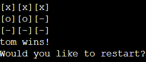
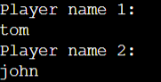

# Knots-and-Crosses

Knots-and-Crosses is a game that hopes to encourage people to take a break from their work and have some fun playing a game against a friend which shows pythons effectiveness in game making. Knots-and-Crosses is a game built using only python the users to play a quick game against eachother.

## User Experience

### User Stories

1. As a user who is bored and want to play a game
2. I expect to find a simple intuitive game to play
3. As someone who is interested in the use of python
4. I expect to play a game built using python
5. As a user who wants to know the outcome of the game
6. I expect it to be clearly shown who has won the game

## Features

### Current Features

* #### Game-board Example

 * This section clearly demonstrates to users the values that correspond ot the position on the game-board. This makes it clear what buttons are needed to play the game.

* #### Player Names

* This area allows for the input of each players name which will then be used later to specify who has won the game.

* #### Game Area

* This area shows the progression of the game as the players pick their positions on the board. This area also clearly shows which player has won the game or when the game is over. This makes it very easy to understand what is occuring in the game and at what point it finishes.

### Feature ideas to implement

* To be able to keep score track
* A timer showing how long each game lasts

## Testing

### General testing

* I used multiple online python IDE to check code runs well and game works
* I ran the python code in the github terminal and consistently printed to check code came out correctly
* Confirmed mandatory data fields are not empty

### Bugs

#### Known, Unfixed Bugs

* All bugs known that occured during testing has been fixed.

## Deployment

## Credits

### Content

* The template used was the [CI full template](https://github.com/Code-Institute-Org/p3-template)
* Some inspiration for the loops came from [W3schools](https://www.w3schools.com/).
